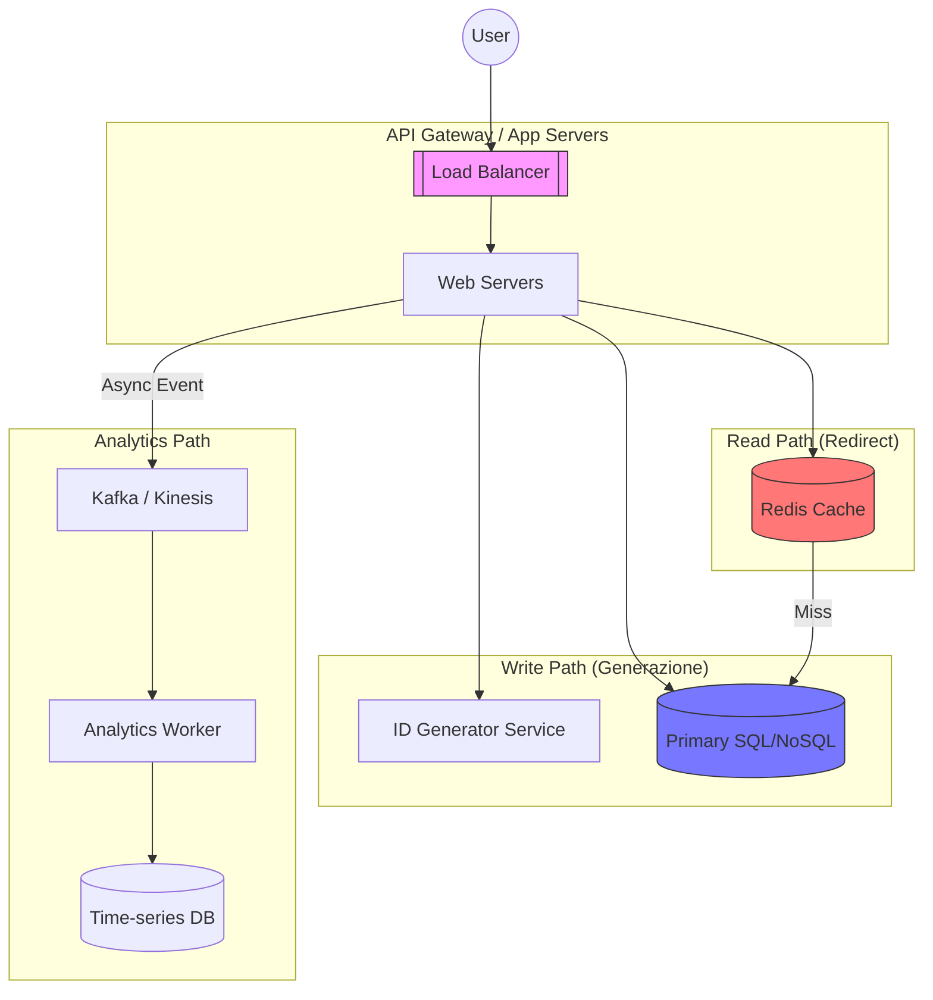

# Case Study: Scalable URL Shortener

Questo case study analizza la progettazione di un sistema tipo **Bitly** o **TinyURL**, capace di gestire milioni di link e miliardi di redirect al mese.

---

## 1. Requisiti e Scale
### Funzionali
- Generazione di un codice breve unico per un URL lungo.
- Redirect (301/302) dal codice breve all'URL originale.
- Supporto per la scadenza dei link.
- Analytics di base (numero di click).

### Non-Funzionali
- **Disponibilità**: Altissima per il path di redirect (se il sistema è giù, i link nel mondo non funzionano).
- **Latenza**: Redirect p95 < 50ms.
- **Scalabilità**: 200k RPS (Read) e 5k RPS (Write).

---

## 2. Architettura ad alto livello

---

## 3. Deep Dive Tecnologico

### A. Strategia di Generazione ID (The "Heart")
Per evitare collisioni senza dover fare un `SELECT` prima di ogni `INSERT`, usiamo un approccio a **Range Allocation**:
1.  Un servizio centrale (es. usando **Zookeeper** o un DB centrale) distribuisce "range" di ID ai server (es. Server A riceve 1-1000, Server B riceve 1001-2000).
2.  I server generano ID localmente finché il range non finisce.
3.  L'ID numerico viene convertito in **Base62** ([0-9, a-z, A-Z]) per ottenere il codice breve (es. ID `125` -> `cb`).

### B. Read Path: Ottimizzazione della Latenza
Dato che il rapporto Read/Write è 40:1, il path di redirect deve essere ultra-veloce:
- **Caching**: Usiamo Redis per memorizzare i mapping `codice -> URL` più popolari.
- **Cache Eviction**: LRU (Least Recently Used) è ideale qui.
- **HTTP Status**: 
    - `301 Moved Permanently`: Il browser memorizza il redirect, riducendo il carico su di noi ma perdiamo analytics precise.
    - `302 Found`: Il browser ci ricontatta ogni volta. Migliore per analytics, più carico per noi.

### C. Sharding del Database
Con miliardi di link, un solo DB non basta. Shardiamo per `Short Code`:
- Il `Short Code` determina su quale shard risiede il metadato.
- Questo garantisce che ogni lookup sia una "Single-Shard Query", mantenendo la latenza bassa.

---

## 4. Trade-offs e Decisioni Critiche

| Problema | Scelta | Rationale |
| :--- | :--- | :--- |
| **Storage** | NoSQL (Cassandra/Dynamo) | Alta disponibilità e scaling lineare per lookup chiave-valore. |
| **Consistency** | Eventual Consistency | Non è critico se un link appena creato è visibile 100ms dopo. |
| **Analytics** | Asincrona | Non vogliamo rallentare il redirect dell'utente per scrivere un log di analytics. |

---

## 5. Failure Modes
1.  **ID Generator down**: I server usano i range pre-allocati finché possono, garantendo una finestra di sopravvivenza.
2.  **Redis flush/outage**: Il carico si sposta sul DB. Dobbiamo avere read-replicas pronte a scalare.
3.  **Abuso (Spam/Phishing)**: Integrazione asincrona con servizi di "Safe Browsing" per marcare i link malevoli.

---

## 6. Prossimi Passi (Evoluzione)
- Supporto per **Custom Aliases** (es. `short.ly/saldi-estivi`).
- **Geographic Routing**: Redirect a server vicini all'utente per ridurre la latenza di rete.
