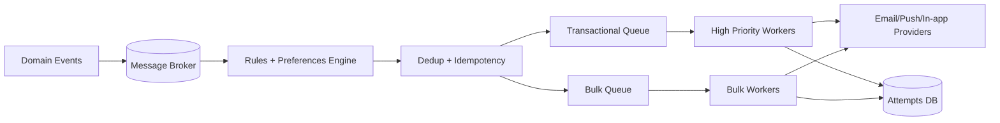

# Exercise 03 — Design a Notification System (Q&A + Suggested Solution)

## Scenario

Design a multi-channel notification system for a SaaS platform.
Initial channels:
- Email
- Mobile push
- In-app

Trigger events:
- `OrderShipped`
- `PaymentFailed`
- `WeeklyDigest`

### Requirements
- peak traffic: **20k events/s** incoming
- delivery p95:
  - transactional (`PaymentFailed`): < 10s
  - non-transactional (`WeeklyDigest`): < 10 min
- user preferences support (opt-in/opt-out by channel)
- duplicate notification deduplication
- retry and channel fallback (e.g., push fails -> email)

---

## Questions

1. Which clarifying questions do you ask before drawing the architecture?
2. What minimum data model is needed?
3. How do you separate transactional and bulk flows?
4. How do you implement deduplication and idempotency?
5. How do you schedule weekly digest delivery?
6. Which failure modes do you consider and how do you mitigate them?

---

## Suggested Answers

### A1) Clarifying questions
- Are there provider limits (SMTP, APNs/FCM) by tenant/region?
- Do we need multi-region active-active, or is active-passive enough?
- What is the retention requirement for in-app notifications?
- Do we need language/locale preferences and quiet hours?

Assumption:
- single region initially, multi-tenant, basic GDPR compliance.

### A2) Minimal data model
- `notification_event(id, type, user_id, payload, created_at)`
- `user_preferences(user_id, channel, enabled, quiet_hours, locale)`
- `notification_attempt(id, event_id, channel, provider, status, error, sent_at)`
- `dedup(event_hash, ttl)`

### A3) Transactional vs bulk
- Separate topics/queues:
  - `notif.transactional` (high priority)
  - `notif.bulk` (low priority, batch-friendly)
- Dedicated worker pools with independent autoscaling.
- Per-channel/provider rate limits.

### A4) Dedup + idempotency
- Generate `dedup_key = hash(user_id + type + business_id + time_bucket)`.
- Atomic check-and-set in Redis/DB:
  - if key exists: skip
  - if key does not exist: process and store with TTL
- Each attempt writes `attempt_id` and status for audit/retry.

### A5) Weekly digest scheduling
- A scheduler publishes `WeeklyDigestRequested` events.
- An aggregator reads weekly activity and builds digest payloads.
- A dispatcher sends within configured time windows and respects quiet hours.

### A6) Failure modes + mitigations
1. Email provider outage:
   - retry with backoff
   - fallback to secondary provider
2. Sudden event spike:
   - broker buffering
   - shed load on bulk before transactional
3. Template rendering bug:
   - template versioning
   - canary rollout + fast rollback

---

## Suggested high-level architecture

---

## Trade-offs to discuss in interviews
- stronger preference consistency vs higher throughput
- aggressive batching (lower cost) vs higher latency
- strict deduplication (less spam) vs risk of dropping legitimate notifications

