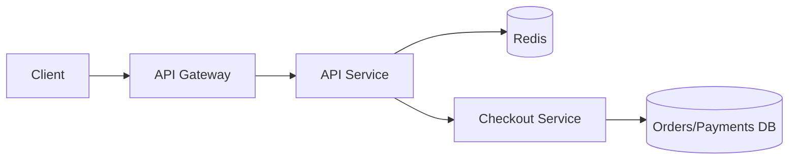

# Exercise 01 — Design a Rate Limiter (Q&A + Solution)

## Scenario

You run a public HTTP API for a product.
You need to protect `POST /checkout` and `GET /catalog`.

### Requirements

* **Per user:** **100 requests/minute** steady rate
* **Allow short bursts:** up to **10 requests/second** (brief spikes)
* **Peak traffic:** **50k RPS** overall across all endpoints
* System is **horizontally scaled** (many API instances)
* Prefer **low latency**; must not become a **single point of failure**

### Deliverables

* requirements clarification
* algorithm choice
* where to enforce
* data/state design
* failure modes
* how retries + idempotency should work for `POST /checkout`

---

## Questions (answer these first)

1. **Q1)** What clarifying questions do you ask?
2. **Q2)** Which algorithm(s) do you choose and why?
3. **Q3)** Where do you enforce the rate limit (gateway/service/both)?
4. **Q4)** What state do you store and what key do you rate-limit on?
5. **Q5)** How do you scale it to 50k RPS?
6. **Q6)** What do you return to clients when limited?
7. **Q7)** What are 3 failure modes and mitigations?
8. **Q8)** How do retries and idempotency apply to `POST /checkout`?

---

# Suggested Answers (Q&A)

## A1) Clarifying questions

* Is the limit **per user**, per API key, per IP, or a combination?
* Are limits different for `GET /catalog` vs `POST /checkout`?
* Do we need **global limits** (protect backend) in addition to per-user?
* What is acceptable behavior if the limiter dependency (e.g., Redis) is down: **fail-open** or **fail-closed**?
* Single region or multi-region? Any requirement for per-region independence?

*Assumption for this exercise:* per authenticated `user_id`; multi-instance single region; **fail-closed for checkout**, **fail-open for catalog**.

---

## A2) Algorithm choice

Use **Token Bucket** per user:

* the **refill rate** enforces the steady limit
* the **bucket size** allows bursts

Reason: token bucket gives good real-world behavior and is easy to implement with **atomic updates**.

> **Note:** if you need both “100/min” **and** “10/sec” strictly, you can use **two limiters** in parallel:
>
> * one limiter for **10/sec**
> * one limiter for **100/min**
>
> A request is allowed only if **both** pass.

---

## A3) Enforcement points

Layered approach:

1. **API Gateway / Edge**: coarse limit (per IP / per API key) to stop obvious abuse early.
2. **Service-level**: authoritative per-user + per-endpoint limits (especially for expensive endpoints like checkout).

This avoids burning application resources on requests that should be rejected.

---

## A4) State and keys

### Rate-limit keys

Examples:

* `rl:{user_id}:checkout`
* `rl:{user_id}:catalog`

Optionally (backend protection):

* `rl_global:checkout`

### Token bucket state

Store:

* `tokens` (float or integer)
* `last_refill_ts` (server time)

Config parameters:

* `refill_rate`
* `bucket_capacity`

### Storage

* **Redis** (fast shared state across instances)
* Use **atomic logic** (Lua script / Redis transactions) to avoid race conditions.

---

## A5) Scaling to 50k RPS

Key points:

* Keep limiter logic **O(1)** per request.
* Use **Redis Cluster** (sharding) and keep keys evenly distributed.
* Avoid hot keys by:

  * per-user keys (spread out)
  * adding global limits only if needed (global keys can become hot → shard them or keep them coarse)

Performance tips:

* pipeline requests if possible
* keep Redis payloads tiny
* set TTL on keys to auto-cleanup inactive users

Back-of-the-envelope:

* If `TTL = 10 minutes` and active users per 10 minutes ≈ `200k`, that’s ~`200k` keys per endpoint.

---

## A6) Client response on limiting

Return:

* **HTTP 429 Too Many Requests**
* `Retry-After: <seconds>`

Optionally:

* `X-RateLimit-Limit`
* `X-RateLimit-Remaining`
* `X-RateLimit-Reset`

Client guidance:

* don’t retry immediately on **429**
* use exponential backoff + jitter for transient errors, not for hard limits

---

## A7) Failure modes + mitigations (3 examples)

1. **Redis down / high latency**

   * `GET /catalog`: fail-open (serve best-effort)
   * `POST /checkout`: fail-closed (protect money/DB)
   * mitigation: timeouts + circuit breaker + fallback policy

2. **Clock skew / time issues**

   * rely on server time (not client time)
   * tolerate small drift; use monotonic time if available

3. **Hot user key (abuse)**

   * per-user limiter contains it
   * add per-IP limiter at gateway
   * add WAF/bot detection if needed

---

## A8) Retries + idempotency for `POST /checkout`

* Clients may retry after timeout or `503`.
* `POST /checkout` must be **idempotent** to avoid duplicate orders/charges.

Implementation:

* Require an `Idempotency-Key` header.
* Store `(user_id, idempotency_key) -> response` with TTL (e.g., 24h).
* On duplicate key: return the original response (same order id, same status).
* Add DB uniqueness constraints for defense-in-depth.

Retry policy:

* retry only on transient errors (timeouts/`503`)
* exponential backoff + jitter
* cap attempts and total retry time budget
* don’t retry on `4xx` (except maybe `409` depending on semantics)

---

# Full Solution (high-level design)

## Components

* Client
* API Gateway (coarse per-IP/API-key rate limit)
* API Service (per-user/per-endpoint token bucket)
* Redis (shared limiter state + idempotency records)
* Checkout Service / DB

## Diagram

## Token Bucket parameters (example)

We want:

* steady: `100 req/min ≈ 1.67 req/sec`
* burst: allow up to `10 req/sec` briefly

One simple choice:

* `refill_rate = 1.67 tokens/sec`
* `bucket_capacity = 10 tokens`

Behavior:

* a user can burst ~10 immediate requests
* then must follow the steady rate on average

---

## Redis atomic check (conceptual)

For each request:

1. Load `tokens` and `last_refill_ts`.
2. Compute `elapsed = now - last_refill_ts`.
3. Refill:

   * `tokens = min(capacity, tokens + elapsed * refill_rate)`
4. If `tokens >= 1`:

   * decrement `tokens` and **allow**.
5. Else:

   * **reject** with `429` and compute a `Retry-After`.

Implementation detail: do steps 1–5 atomically with a **Lua script** to avoid races.

---

## Idempotency record (conceptual)

* **Key:** `idem:{user_id}:{idempotency_key}`
* **Value:** serialized response (order_id, status, amount, etc.)
* **TTL:** 24 hours

### Flow for `POST /checkout`

1. Check if the idempotency key exists → return stored response.
2. Otherwise execute checkout (create order/charge).
3. Store response under the idempotency key.
4. Return response.

---

## Quick “Interview-style” one-liners

* **Algorithm:** token bucket (optionally + minute limiter if strict)
* **State:** Redis + atomic update
* **Enforcement:** gateway + service
* **Reliability:** timeouts + circuit breaker + fail-open/fail-closed policy
* **Correct retries:** `Idempotency-Key` + stored result + DB constraints