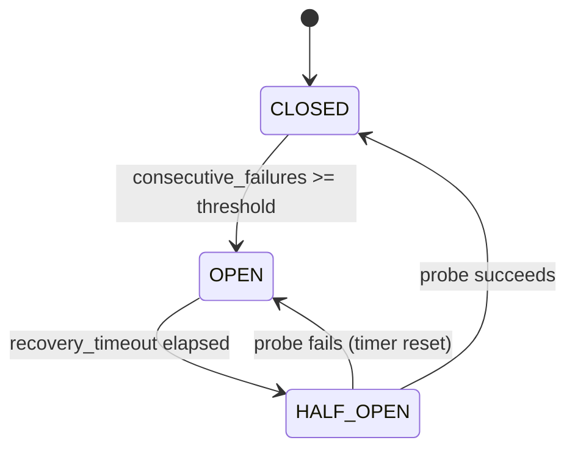

# Circuit Breaker

**File:** [`circuit_breaker_demo.py`](./circuit_breaker_demo.py)  
**Tests:** [`test_circuit_breaker.py`](./test_circuit_breaker.py)  
**Theory cross-link:** [`Theory/002_rate_limiting_retries_idempotency.md`](../../../Theory/002_rate_limiting_retries_idempotency.md)

---

## What problem does it solve?

When service **A** calls service **B** and B starts failing or responding slowly,
A accumulates blocked threads (or goroutines) waiting for responses that will never
come. Those blocked threads starve other callers of A — a **cascading failure**.

Worse, a steady stream of requests from A towards an already-struggling B makes B's
recovery harder.

The Circuit Breaker pattern breaks this feedback loop by **short-circuiting calls**
to B as soon as it detects a pattern of failures. Rejected calls fail immediately
(fast-fail), without touching B at all, giving B time to recover.

---

## The three-state FSM

The breaker is a **finite-state machine (FSM)** with three states:

```
                   consecutive_failures >= threshold
     CLOSED  ──────────────────────────────────────►  OPEN
       ▲                                                 │
       │                                                 │ recovery_timeout elapsed
       │                                                 ▼
       └──────────────────────────────────────────  HALF_OPEN
             first probe succeeds                        │
                                                         │ probe fails
                                                         ▼
                                                      OPEN  (timer reset)
```



| State | Behaviour | Calls allowed? |
|---|---|---|
| **CLOSED** | Normal operation. Failures are counted. | ✅ All |
| **OPEN** | Fast-fail. No downstream load. Waits for timeout. | ❌ None |
| **HALF_OPEN** | Trial calls allowed up to `half_open_max_calls`. | ⚠️ Limited |

---

## Configuration parameters

| Parameter | Default | Meaning |
|---|---|---|
| `failure_threshold` | `3` | Consecutive failures needed to open the circuit |
| `recovery_timeout_seconds` | `2.0` | Seconds the breaker stays OPEN before allowing probes |
| `half_open_max_calls` | `2` | Max concurrent trial calls in HALF_OPEN |
| `clock` | `time.monotonic` | Injected time source (swap in tests) |

---

## Public API

The breaker exposes three methods. The caller is responsible for the
call-attempt/success/failure lifecycle:

```python
cb = CircuitBreaker(failure_threshold=3, recovery_timeout_seconds=2.0)

if cb.before_call():            # → True: call is permitted
    try:
        result = downstream()
        cb.record_success()
    except Exception:
        cb.record_failure()
else:
    raise CircuitOpenError()    # fast-fail, no downstream call
```

### `before_call() → bool`

- If **OPEN**: checks whether the recovery timeout has elapsed.
  - Not yet elapsed → returns `False`.
  - Elapsed → transitions to HALF_OPEN, returns `True` (first trial call).
- If **HALF_OPEN**: grants calls up to `half_open_max_calls`; blocks the rest.
- If **CLOSED**: always returns `True`.

> **Design note — lazy timeout check.** There is no background thread or timer.
> The OPEN → HALF_OPEN transition happens *lazily* inside `before_call()` every
> time a caller tries. This simplifies the implementation significantly: no
> goroutine, no scheduler, no thread-safety concerns around timer callbacks.

### `record_success()`

| State at call time | Effect |
|---|---|
| CLOSED | Resets `consecutive_failures` to `0` |
| HALF_OPEN | Transitions to CLOSED (recovery confirmed) |
| OPEN | Resets counter (should not happen in normal usage) |

### `record_failure()`

| State at call time | Effect |
|---|---|
| CLOSED | Increments counter; opens if `>= threshold` |
| HALF_OPEN | Immediately re-opens, resets recovery timer |
| OPEN | Handled gracefully (should not happen) |

---

## State transition test map

Each FSM edge is exercised by a dedicated test:

| Transition | Test method |
|---|---|
| Start → CLOSED | `test_starts_closed` |
| CLOSED (no trip, below threshold) | `test_does_not_open_below_threshold` |
| CLOSED → OPEN | `test_opens_after_failure_threshold` |
| CLOSED: success resets counter | `test_success_resets_failure_counter` |
| OPEN: blocks before timeout | `test_stays_open_before_timeout` |
| OPEN → HALF_OPEN | `test_transitions_to_half_open_after_timeout` |
| HALF_OPEN: trial call cap | `test_half_open_allows_limited_trial_calls` |
| HALF_OPEN → CLOSED | `test_half_open_success_closes_circuit` |
| HALF_OPEN → OPEN | `test_half_open_failure_reopens_circuit` |
| OPEN timer reset after re-open | `test_half_open_failure_resets_recovery_timer` |

---

## Clock injection — why and how

The breaker needs to know the current time to decide whether the
`recovery_timeout` has elapsed. The naive implementation calls
`time.monotonic()` directly inside the class. That makes tests painful:
either you patch the global function (fragile) or you add `time.sleep()` calls
(slow and non-deterministic).

Instead, `CircuitBreaker` accepts a `clock` parameter — any `() → float`
callable:

```python
# Production — default, no change needed
cb = CircuitBreaker()

# Test — inject a fake clock with full control
clock = FakeClock(start=0.0)
cb = CircuitBreaker(clock=clock.now)

clock.advance(6.0)          # instant in the test, no sleep
assert cb.before_call()     # HALF_OPEN — timeout has elapsed
```

`FakeClock` (defined in `test_circuit_breaker.py`) is a tiny 3-method class:

| Method | Action |
|---|---|
| `now() → float` | Returns current fake time |
| `advance(seconds)` | Moves time forward |
| `set(t)` | Jumps to an absolute timestamp |

The same pattern is used in `rate_limiter/token_bucket.py` and
`cache/cache_aside_demo.py`.

---

## Trade-offs and real-world considerations

| Topic | This implementation | Production considerations |
|---|---|---|
| **Failure counting** | Consecutive failures only | Real systems often use a **sliding time window** (e.g. "5 failures in the last 10 s") to avoid tripping on a single burst |
| **Half-open probes** | Fixed max concurrent calls | Some implementations use a **success threshold** (e.g. "3 consecutive successes to close"), not just 1 |
| **Thread safety** | None (single-threaded demo) | In Go/Java, all state mutations need a mutex or atomic operations |
| **Timeout check** | Lazy (inside `before_call`) | Sufficient for most cases; avoids a background goroutine |
| **Metrics** | None | Production CBs export counters: `circuit_open_total`, `circuit_half_open_total`, `fast_fail_total` |
| **Per-endpoint granularity** | One breaker per dependency | Real systems use one breaker **per downstream endpoint**, sometimes per HTTP method |

---

## Running the demo

```bash
# From the repo root
python -m code.python.resilience.circuit_breaker_demo
```

The demo simulates 20 requests against a flaky dependency (40% failure rate)
with a fixed random seed, so the output is reproducible. You can observe the
breaker opening, blocking calls, and recovering.

---

## Running the tests

```bash
# From the repo root
python -m pytest code/python/resilience/test_circuit_breaker.py -v

# Or with the Makefile
make test-python
```
